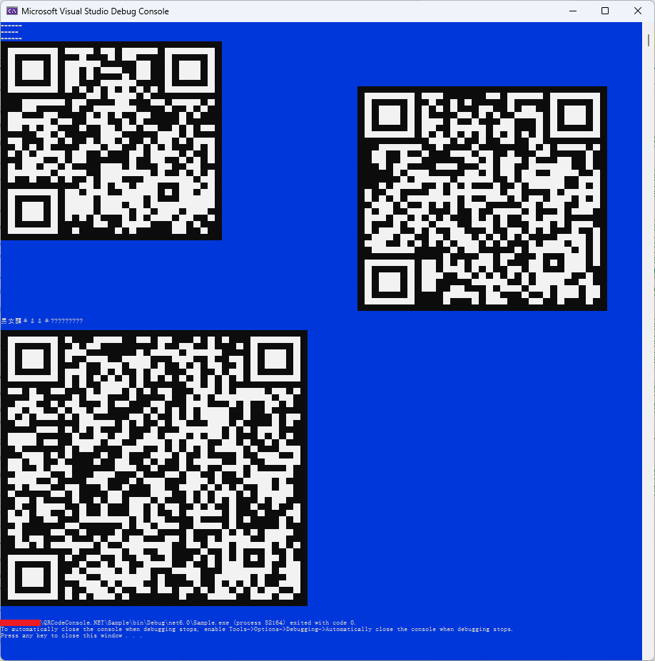
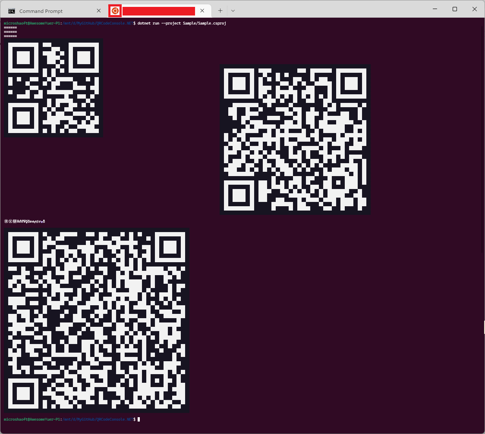

# QR Code Console
Print QR Code to console.

Support Linux/Windows




```c#
using Microshaoft;
using System;

System.Console.Out.WriteQRCodeLine
            (
                      data                          : "于斯人也"             //待生成二维码原始数据

                    , errorCorrectionLevel          : "M"                   //二维码纠错级别
                    , characterSet                  : "utf-8"               //二维码字符集

                    , qrCompact                     : true                  //二维码是否压缩
                    , pureBarcode                   : true                  //是否纯条码
                    , qrVersion                     : 10                    //二维码版本
                    , disableECI                    : true                  //是否禁用ECI编码段
                    , gs1Format                     : true                  //是否GS1格式

                    , width                         : 10                    //二维码图像生成宽度
                    , height                        : 10                    //二维码图像生成高度
                    , margin                        : 1                     //二维码图像生成边缘空白宽高度

                    , darkColor                     : ConsoleColor.Black    //控制台二维码输出深颜色
                    , lightColor                    : ConsoleColor.White    //控制台二维码输出浅颜色
                    , thresholdOfDarkLightColor     : 200
                    , placeholderChar               : '囍'                  //控制台二维码输出占位符 同时支持窄宽字符: !@# ㊚㊛囍♀♂♂♀☿♁⚢⚣⚤⚥⚦⚧⚨

                    , outputPostionLeft             : null!                 //控制台二维码输出横向位置
                    , outputPostionTop              : null!                 //控制台二维码输出纵向位置
            );
```

Thanks for Open Source:

https://github.com/stulzq/QRConsole

https://www.cnblogs.com/stulzq/p/14282461.html