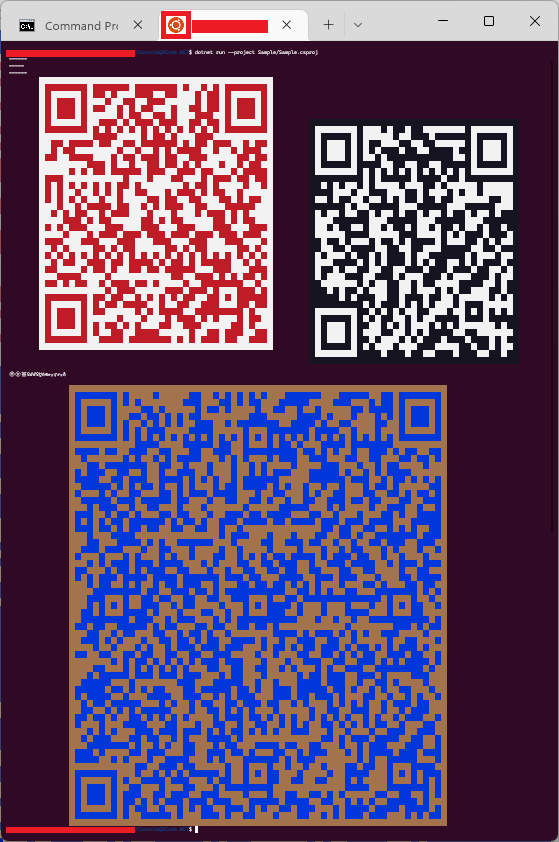

# Console QR Code .NET
Print QR Code to console.

Support Linux/Windows

## Thanks for Open Source:

https://github.com/stulzq/QRConsole

https://www.cnblogs.com/stulzq/p/14282461.html

## Sample:
```c#
using Microshaoft;
using System;
using System.Collections.Generic;
using System.Text;
using ZXing;

Console.WriteLine("======");
Console.WriteLine("======\b \b");
Console.WriteLine("======");

System.Console.Out.PrintQRCodeLine
            (
                  data  : $@"AwesomeYuer于斯人也@Microshaoft
                             AwesomeYuer于斯人也@Microshaoft"   //待生成二维码原始数据
                    
                , 10                                            //outputPostionLeft:    控制台二维码输出横向位置
                , null!                                         //outputPostionTop:     控制台二维码输出纵向位置

                , 10                                            //width:                二维码图像生成宽度
                , 10                                            //height:               二维码图像生成高度
                , 1                                             //margin:               二维码图像生成边缘空白宽高度

                , ConsoleColor.White                            //darkColor:            控制台二维码输出深颜色
                , ConsoleColor.Red                              //lightColor:           控制台二维码输出浅颜色

                , nameof(Encoding.UTF8)                         //二维码字符集 支持中文不乱码
                , '囍'                                           //控制台二维码输出占位符 同时支持宽或窄字符, 窄: !@# , 宽: ㊚㊛囍♀♂♂♀☿♁⚢⚣⚤⚥⚦⚧⚨
            );

Console.Out.PrintQRCodeLine
                (
                    "https://www.cnblogs.com/stulzq/p/14282461.html?Thanks"     //待生成二维码原始数据
                    , 100                                                       //outputPostionLeft:    控制台二维码输出横向位置
                    , 10                                                        //outputPostionTop:     控制台二维码输出纵向位置
                    , placeholderChar: '♂'                                      //控制台二维码输出占位符 同时支持宽或窄字符, 窄: !@# , 宽: ㊚㊛囍♀♂♂♀☿♁⚢⚣⚤⚥⚦⚧⚨
                );

Console.WriteLine();
Console.WriteLine();
Console.WriteLine("㊚㊛囍♀♂♂♀☿♁⚢⚣⚤⚥⚦⚧⚨");
Console.WriteLine();
Console.WriteLine();

var s =
"""
♂㊚囍㊛♀
满屏荒唐言
一把辛酸泪
都言作者痴
谁解比特位
~ Duang ~

♂㊚囍㊛♀
满屏荒唐言
一把辛酸泪
都言作者痴
谁解比特位
~ Duang ~

♂㊚囍㊛♀
满屏荒唐言
一把辛酸泪
都言作者痴
谁解比特位
~ Duang ~
""";
Console.Out.PrintQRCodeLine
            (
                s
                , new Dictionary<EncodeHintType, object> ()
                    {
                          { EncodeHintType.CHARACTER_SET            , nameof(Encoding.UTF8)                 }
                        , { EncodeHintType.ERROR_CORRECTION         , "L"                                   }
                        , { EncodeHintType.QR_COMPACT               , true                                  }
                        , { EncodeHintType.PURE_BARCODE             , true                                  }
                        //, { EncodeHintType.QR_VERSION               , 10                                    }
                        //, { EncodeHintType.DISABLE_ECI              , true                                  }
                        //, { EncodeHintType.GS1_FORMAT               , true                                  }
                        , { EncodeHintType.MARGIN                   , 1                                     }
                        //, { EncodeHintType.WIDTH                    , width                                 }
                        //, { EncodeHintType.HEIGHT                   , height                                }
                    }
                
                , 20                                                    //outputPostionLeft:    控制台二维码输出横向位置
                , darkColor                 : ConsoleColor.Yellow
                , lightColor                : ConsoleColor.DarkBlue
                , placeholderChar: '$'                                  //控制台二维码输出占位符 窄字符 $
            );

Console.Out.PrintQRCodeLine
            (
                $@"AwesomeYuer于斯人也" //待生成二维码原始数据
            );
```

## Tips:
```c#
// Wide Char Detection
var isWideChar = false;
lock (_locker)
{
    (int left, int top) = Console.GetCursorPosition();
    Console.Write(placeholderChar);
    isWideChar = ((Console.CursorLeft - left) > 1);
    while (Console.CursorLeft != left)
    {
        Console.Write("\b \b");
    }
    Console.SetCursorPosition(left, top);
}
```

## Windows Console Output Screenshot:


## Linux/WSL/Ubuntu Console Output Screenshot:

