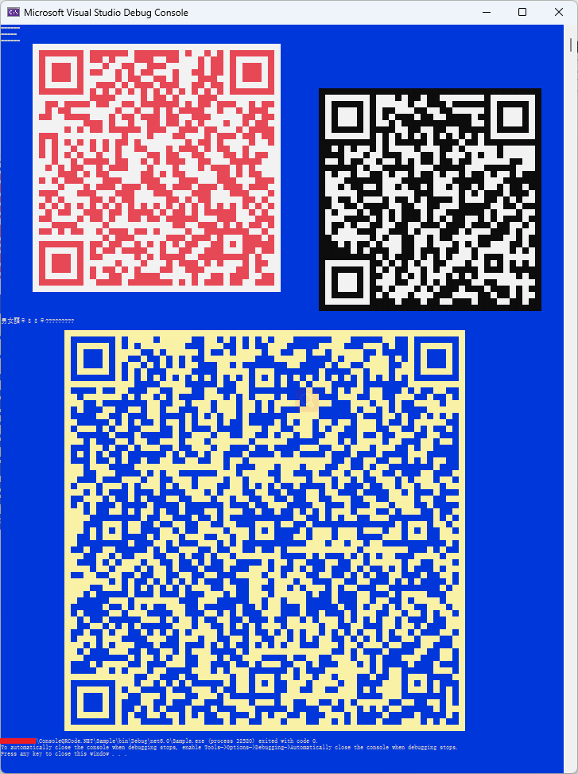

# Console QR Code .NET
Print QR Code to console.

Support Linux/Windows

## Thanks for Open Source:

https://github.com/stulzq/QRConsole

https://www.cnblogs.com/stulzq/p/14282461.html

## Sample:
```c#
using Microshaoft;
using System.Text;
using ZXing;

Console.WriteLine("======");
Console.WriteLine("======\b \b");
Console.WriteLine("======");

var s = $@"AwesomeYuer于斯人也@Microshaoft
                             AwesomeYuer于斯人也@Microshaoft";

//控制台二维码输出占位符参数缺省值为 : '█' ,二维码输出后,此时选择控制台屏幕文本,
//并拷贝到文本文件,再使用某些字体(如:Consolas)的文本编辑器(Windows notepad及默认字体不行)打开,仍然显示为二维码外观,
//使用其他字符作为二维码输出占位符",文本文件中仅显示该字符,相当于禁止文本拷贝二维码

System.Console.Out.PrintQRCodeLine
            (
                  s                                             //data                      :   待生成二维码原始数据

                , 10                                            //outputPostionLeft         :   控制台二维码输出横向位置
                , null!                                         //outputPostionTop          :   控制台二维码输出纵向位置

                , 2                                             //marginInPixel             :   二维码图像生成边缘空白宽高度

                , 30                                            //widthInPixel              :   二维码图像生成宽度
                , 30                                            //heightInPixel             :   二维码图像生成高度

                , ConsoleColor.White                            //darkColor                 :   控制台二维码输出深颜色
                , ConsoleColor.Red                              //lightColor                :   控制台二维码输出浅颜色

                , nameof(Encoding.UTF8)                         //二维码字符集                :   utf-8 支持中文不乱码
                //, '囍'                                        //控制台二维码输出占位符        :   同时支持宽或窄字符, 窄: !@# , 宽: ㊚㊛囍♀♂♂♀☿♁⚢⚣⚤⚥⚦⚧⚨
                //, '█'                                         //控制台二维码输出占位符        :   缺省值为 :   '█' ,此时拷贝控制台屏幕到文本文件使用某些字体的文本编辑器(notepad及默认字体不行)仍然显示为二维码外观, 其他字符不支持 
            );

Console.Out.PrintQRCodeLine
                (
                    "https://www.cnblogs.com/stulzq/p/14282461.html?Thanks"     //待生成二维码原始数据
                    , 100                                                       //outputPostionLeft         :   控制台二维码输出横向位置
                    , 10                                                        //outputPostionTop          :   控制台二维码输出纵向位置
                    , placeholderChar: '♂'                                      //控制台二维码输出占位符       :   同时支持宽或窄字符, 窄: !@# , 宽: ㊚㊛囍♀♂♂♀☿♁⚢⚣⚤⚥⚦⚧⚨
                );

Console.WriteLine();
Console.WriteLine();
Console.WriteLine();
Console.WriteLine();

s =
"""
♂㊚囍㊛♀
满屏荒唐言
一把辛酸泪
都言作者痴
谁解比特位
~ Duang ~

♂㊚囍㊛♀
满屏荒唐言
一把辛酸泪
都言作者痴
谁解比特位
~ Duang ~

♂㊚囍㊛♀
满屏荒唐言
一把辛酸泪
都言作者痴
谁解比特位
~ Duang ~
""";
Console.Out.PrintQRCodeLine
            (
                s
                , new Dictionary<EncodeHintType, object>()
                    {
                          { EncodeHintType.CHARACTER_SET            , nameof(Encoding.UTF8) }   //编码字符集
                        , { EncodeHintType.ERROR_CORRECTION         , "L"                   }   //编码纠错级别   : L, M, Q, H
                        , { EncodeHintType.QR_COMPACT               , true                  }   //编码是否压缩
                        , { EncodeHintType.PURE_BARCODE             , true                  }   //编码是否纯条码
                        //, { EncodeHintType.QR_VERSION               , 10                  }   //编码版本
                        //, { EncodeHintType.DISABLE_ECI              , true                }   //编码是否禁用ECI编码段
                        //, { EncodeHintType.GS1_FORMAT               , true                }   //编码是否GS1格式
                        , { EncodeHintType.MARGIN                   , 3                     }
                        //, { EncodeHintType.WIDTH                    , 15                  }
                        //, { EncodeHintType.HEIGHT                   , 15                  }
                    }

                , 20                                                //outputPostionLeft     :   控制台二维码输出横向位置
                , darkColor             : ConsoleColor.Yellow
                , lightColor            : ConsoleColor.DarkBlue
                , placeholderChar       : '$'                       //控制台二维码输出占位符   :   窄字符 $
            );
s = $@"AwesomeYuer 于斯人也 한국어 ことに доступны ㊚㊛囍♀♂♂♀☿♁⚢⚣⚤⚥⚦⚧⚨ 🌍💩";

Console.Out.PrintQRCodeLine
            (
                s       //待生成二维码原始数据
            );
```
## Windows/Linux Console Output Text:
```
======
=====
======
          ██████████████████████████████████████████████████████████████████████████████████
          ██████████████████████████████████████████████████████████████████████████████████
          ████              ██            ██              ██  ████  ██  ██              ████
          ████  ██████████  ██    ██  ██████      ████    ██████  ██    ██  ██████████  ████
          ████  ██      ██  ██████  ████    ████      ██████████  ██    ██  ██      ██  ████
          ████  ██      ██  ██    ████  ██  ██    ██████  ████    ██    ██  ██      ██  ████
          ████  ██      ██  ██████████  ██    ████    ██  ██████      ████  ██      ██  ████
          ████  ██████████  ████      ██  ██      ██      ████    ██    ██  ██████████  ████        ♂♂♂♂♂♂♂♂♂♂♂♂♂♂♂♂♂♂♂♂♂♂♂♂♂♂♂♂♂♂♂♂♂♂♂
          ████              ██  ██  ██  ██  ██  ██  ██  ██  ██  ██  ██  ██              ████        ♂♂♂♂♂♂♂♂♂♂♂♂♂♂♂♂♂♂♂♂♂♂♂♂♂♂♂♂♂♂♂♂♂♂♂
          ████████████████████        ████████  ██    ██  ██████      ██████████████████████        ♂♂♂♂♂♂♂♂♂♂♂♂♂♂♂♂♂♂♂♂♂♂♂♂♂♂♂♂♂♂♂♂♂♂♂
          ██████    ██        ██    ████    ██            ██  ██    ██      ████  ██    ████        ♂♂♂♂♂♂♂♂♂♂♂♂♂♂♂♂♂♂♂♂♂♂♂♂♂♂♂♂♂♂♂♂♂♂♂
          ██████  ██    ██████████████  ████  ████  ██  ██        ████  ████  ██      ██████        ♂♂♂♂♂♂♂♂♂♂♂♂♂♂♂♂♂♂♂♂♂♂♂♂♂♂♂♂♂♂♂♂♂♂♂
          ████    ████        ██████  ██    ██      ██    ████      ██████████    ██    ████        ♂♂♂♂♂♂♂♂♂♂♂♂♂♂♂♂♂♂♂♂♂♂♂♂♂♂♂♂♂♂♂♂♂♂♂
          ██████████████████      ██  ████  ████    ██    ██  ██  ██████  ████  ██    ██████        ♂♂♂♂♂♂♂♂♂♂♂♂♂♂♂♂♂♂♂♂♂♂♂♂♂♂♂♂♂♂♂♂♂♂♂
          ████████████  ██  ██    ██          ██      ████      ██    ██████  ██        ████        ♂♂♂♂♂♂♂♂♂♂♂♂♂♂♂♂♂♂♂♂♂♂♂♂♂♂♂♂♂♂♂♂♂♂♂
          ████      ████████████████████  ██████  ██████    ██████  ██      ██    ██    ████        ♂♂♂♂♂♂♂♂♂♂♂♂♂♂♂♂♂♂♂♂♂♂♂♂♂♂♂♂♂♂♂♂♂♂♂
          ████  ██  ██  ██  ██  ██  ██    ██  ██████████████  ██    ██  ████████  ████  ████        ♂♂♂♂♂♂♂♂♂♂♂♂♂♂♂♂♂♂♂♂♂♂♂♂♂♂♂♂♂♂♂♂♂♂♂
          ████  ██  ████  ████  ██  ██  ████    ██████  ██      ██  ██    ████  ████████████        ♂♂♂♂♂♂♂♂♂♂♂♂♂♂♂♂♂♂♂♂♂♂♂♂♂♂♂♂♂♂♂♂♂♂♂
          ████  ██  ██  ██  ████  ████  ████████    ██    ████    ██████    ██  ██    ██████        ♂♂♂♂♂♂♂♂♂♂♂♂♂♂♂♂♂♂♂♂♂♂♂♂♂♂♂♂♂♂♂♂♂♂♂
          ████████  ████  ██        ██    ████  ██  ██      ████    ██████          ████████        ♂♂♂♂♂♂♂♂♂♂♂♂♂♂♂♂♂♂♂♂♂♂♂♂♂♂♂♂♂♂♂♂♂♂♂
          ██████  ██  ██    ████  ██      ██████  ██████  ██████  ██      ██  ██  ██████████        ♂♂♂♂♂♂♂♂♂♂♂♂♂♂♂♂♂♂♂♂♂♂♂♂♂♂♂♂♂♂♂♂♂♂♂
          ██████████      ██  ██    ██████████    ██  ██    ██████████    ██  ██    ████████        ♂♂♂♂♂♂♂♂♂♂♂♂♂♂♂♂♂♂♂♂♂♂♂♂♂♂♂♂♂♂♂♂♂♂♂
          ████  ██  ██      ██████      ██████      ██████      ██████      ██████      ████        ♂♂♂♂♂♂♂♂♂♂♂♂♂♂♂♂♂♂♂♂♂♂♂♂♂♂♂♂♂♂♂♂♂♂♂
          ██████████  ██████  ██      ██      ██      ██      ██      ██      ██      ██████        ♂♂♂♂♂♂♂♂♂♂♂♂♂♂♂♂♂♂♂♂♂♂♂♂♂♂♂♂♂♂♂♂♂♂♂
          ████      ██████      ██████      ██████      ██████      ██████      ██████  ████        ♂♂♂♂♂♂♂♂♂♂♂♂♂♂♂♂♂♂♂♂♂♂♂♂♂♂♂♂♂♂♂♂♂♂♂
          ██████  ██  ████████    ██  ██    ██████████    ██  ██    ██████████    ██  ██████        ♂♂♂♂♂♂♂♂♂♂♂♂♂♂♂♂♂♂♂♂♂♂♂♂♂♂♂♂♂♂♂♂♂♂♂
          ████  ██  ██  ██  ██  ██  ██  ██  ██  ██  ██  ██  ██  ██  ██  ██  ██  ██  ██  ████        ♂♂♂♂♂♂♂♂♂♂♂♂♂♂♂♂♂♂♂♂♂♂♂♂♂♂♂♂♂♂♂♂♂♂♂
          ██████  ██    ████      ██    ██        ██  ██    ██  ██          ████  ██  ██████        ♂♂♂♂♂♂♂♂♂♂♂♂♂♂♂♂♂♂♂♂♂♂♂♂♂♂♂♂♂♂♂♂♂♂♂
          ████    ████████  ██    ██  ████    ██    ██          ██████      ██████      ████        ♂♂♂♂♂♂♂♂♂♂♂♂♂♂♂♂♂♂♂♂♂♂♂♂♂♂♂♂♂♂♂♂♂♂♂
          ████████        ████████  ████████████████████    ████      ██  ██  ██    ██  ████        ♂♂♂♂♂♂♂♂♂♂♂♂♂♂♂♂♂♂♂♂♂♂♂♂♂♂♂♂♂♂♂♂♂♂♂
          ████    ██  ██    ████  ██      ██    ██  ████████  ████              ████  ██████        ♂♂♂♂♂♂♂♂♂♂♂♂♂♂♂♂♂♂♂♂♂♂♂♂♂♂♂♂♂♂♂♂♂♂♂
          ████████████████████████  ██      ██████████      ██      ██  ██████      ██  ████        ♂♂♂♂♂♂♂♂♂♂♂♂♂♂♂♂♂♂♂♂♂♂♂♂♂♂♂♂♂♂♂♂♂♂♂
          ████              ██    ██    ████  ██  ██  ██  ██    ████    ██  ██          ████        ♂♂♂♂♂♂♂♂♂♂♂♂♂♂♂♂♂♂♂♂♂♂♂♂♂♂♂♂♂♂♂♂♂♂♂
          ████  ██████████  ██  ██    ██        ████  ████    ████      ██████    ██    ████        ♂♂♂♂♂♂♂♂♂♂♂♂♂♂♂♂♂♂♂♂♂♂♂♂♂♂♂♂♂♂♂♂♂♂♂
          ████  ██      ██  ██    ██████████  ██  ██        ████                ██  ████████        ♂♂♂♂♂♂♂♂♂♂♂♂♂♂♂♂♂♂♂♂♂♂♂♂♂♂♂♂♂♂♂♂♂♂♂
          ████  ██      ██  ██████████  ██████  ██████  ██      ██  ██  ██████  ██    ██████        ♂♂♂♂♂♂♂♂♂♂♂♂♂♂♂♂♂♂♂♂♂♂♂♂♂♂♂♂♂♂♂♂♂♂♂
          ████  ██      ██  ██  ██    ██  ██  ██████    ████      ██████████    ██  ████████        ♂♂♂♂♂♂♂♂♂♂♂♂♂♂♂♂♂♂♂♂♂♂♂♂♂♂♂♂♂♂♂♂♂♂♂
          ████  ██████████  ██  ████    ████        ██████████  ████    ██      ████    ████        ♂♂♂♂♂♂♂♂♂♂♂♂♂♂♂♂♂♂♂♂♂♂♂♂♂♂♂♂♂♂♂♂♂♂♂
          ████              ████        ██              ██  ██  ██      ██    ████      ████        ♂♂♂♂♂♂♂♂♂♂♂♂♂♂♂♂♂♂♂♂♂♂♂♂♂♂♂♂♂♂♂♂♂♂♂
          ██████████████████████████████████████████████████████████████████████████████████        ♂♂♂♂♂♂♂♂♂♂♂♂♂♂♂♂♂♂♂♂♂♂♂♂♂♂♂♂♂♂♂♂♂♂♂
          ██████████████████████████████████████████████████████████████████████████████████        ♂♂♂♂♂♂♂♂♂♂♂♂♂♂♂♂♂♂♂♂♂♂♂♂♂♂♂♂♂♂♂♂♂♂♂
                                                                                                    ♂♂♂♂♂♂♂♂♂♂♂♂♂♂♂♂♂♂♂♂♂♂♂♂♂♂♂♂♂♂♂♂♂♂♂


                    $$$$$$$$$$$$$$$$$$$$$$$$$$$$$$$$$$$$$$$$$$$$$$$$$$$$$$$$$$$$$$$$$$$$$$$$$$$$$$$$$$$$$$$$$$$$$$$$$$$$$$$$$$$$$$$$$$$$$$$$$$$$$$$$$$$$$$
                    $$$$$$$$$$$$$$$$$$$$$$$$$$$$$$$$$$$$$$$$$$$$$$$$$$$$$$$$$$$$$$$$$$$$$$$$$$$$$$$$$$$$$$$$$$$$$$$$$$$$$$$$$$$$$$$$$$$$$$$$$$$$$$$$$$$$$$
                    $$$$$$$$$$$$$$$$$$$$$$$$$$$$$$$$$$$$$$$$$$$$$$$$$$$$$$$$$$$$$$$$$$$$$$$$$$$$$$$$$$$$$$$$$$$$$$$$$$$$$$$$$$$$$$$$$$$$$$$$$$$$$$$$$$$$$$
                    $$$$$$$$$$$$$$$$$$$$$$$$$$$$$$$$$$$$$$$$$$$$$$$$$$$$$$$$$$$$$$$$$$$$$$$$$$$$$$$$$$$$$$$$$$$$$$$$$$$$$$$$$$$$$$$$$$$$$$$$$$$$$$$$$$$$$$
                    $$$$$$$$$$$$$$$$$$$$$$$$$$$$$$$$$$$$$$$$$$$$$$$$$$$$$$$$$$$$$$$$$$$$$$$$$$$$$$$$$$$$$$$$$$$$$$$$$$$$$$$$$$$$$$$$$$$$$$$$$$$$$$$$$$$$$$
                    $$$$$$$$$$$$$$$$$$$$$$$$$$$$$$$$$$$$$$$$$$$$$$$$$$$$$$$$$$$$$$$$$$$$$$$$$$$$$$$$$$$$$$$$$$$$$$$$$$$$$$$$$$$$$$$$$$$$$$$$$$$$$$$$$$$$$$
                    $$$$$$$$$$$$$$$$$$$$$$$$$$$$$$$$$$$$$$$$$$$$$$$$$$$$$$$$$$$$$$$$$$$$$$$$$$$$$$$$$$$$$$$$$$$$$$$$$$$$$$$$$$$$$$$$$$$$$$$$$$$$$$$$$$$$$$
                    $$$$$$$$$$$$$$$$$$$$$$$$$$$$$$$$$$$$$$$$$$$$$$$$$$$$$$$$$$$$$$$$$$$$$$$$$$$$$$$$$$$$$$$$$$$$$$$$$$$$$$$$$$$$$$$$$$$$$$$$$$$$$$$$$$$$$$
                    $$$$$$$$$$$$$$$$$$$$$$$$$$$$$$$$$$$$$$$$$$$$$$$$$$$$$$$$$$$$$$$$$$$$$$$$$$$$$$$$$$$$$$$$$$$$$$$$$$$$$$$$$$$$$$$$$$$$$$$$$$$$$$$$$$$$$$
                    $$$$$$$$$$$$$$$$$$$$$$$$$$$$$$$$$$$$$$$$$$$$$$$$$$$$$$$$$$$$$$$$$$$$$$$$$$$$$$$$$$$$$$$$$$$$$$$$$$$$$$$$$$$$$$$$$$$$$$$$$$$$$$$$$$$$$$
                    $$$$$$$$$$$$$$$$$$$$$$$$$$$$$$$$$$$$$$$$$$$$$$$$$$$$$$$$$$$$$$$$$$$$$$$$$$$$$$$$$$$$$$$$$$$$$$$$$$$$$$$$$$$$$$$$$$$$$$$$$$$$$$$$$$$$$$
                    $$$$$$$$$$$$$$$$$$$$$$$$$$$$$$$$$$$$$$$$$$$$$$$$$$$$$$$$$$$$$$$$$$$$$$$$$$$$$$$$$$$$$$$$$$$$$$$$$$$$$$$$$$$$$$$$$$$$$$$$$$$$$$$$$$$$$$
                    $$$$$$$$$$$$$$$$$$$$$$$$$$$$$$$$$$$$$$$$$$$$$$$$$$$$$$$$$$$$$$$$$$$$$$$$$$$$$$$$$$$$$$$$$$$$$$$$$$$$$$$$$$$$$$$$$$$$$$$$$$$$$$$$$$$$$$
                    $$$$$$$$$$$$$$$$$$$$$$$$$$$$$$$$$$$$$$$$$$$$$$$$$$$$$$$$$$$$$$$$$$$$$$$$$$$$$$$$$$$$$$$$$$$$$$$$$$$$$$$$$$$$$$$$$$$$$$$$$$$$$$$$$$$$$$
                    $$$$$$$$$$$$$$$$$$$$$$$$$$$$$$$$$$$$$$$$$$$$$$$$$$$$$$$$$$$$$$$$$$$$$$$$$$$$$$$$$$$$$$$$$$$$$$$$$$$$$$$$$$$$$$$$$$$$$$$$$$$$$$$$$$$$$$
                    $$$$$$$$$$$$$$$$$$$$$$$$$$$$$$$$$$$$$$$$$$$$$$$$$$$$$$$$$$$$$$$$$$$$$$$$$$$$$$$$$$$$$$$$$$$$$$$$$$$$$$$$$$$$$$$$$$$$$$$$$$$$$$$$$$$$$$
                    $$$$$$$$$$$$$$$$$$$$$$$$$$$$$$$$$$$$$$$$$$$$$$$$$$$$$$$$$$$$$$$$$$$$$$$$$$$$$$$$$$$$$$$$$$$$$$$$$$$$$$$$$$$$$$$$$$$$$$$$$$$$$$$$$$$$$$
                    $$$$$$$$$$$$$$$$$$$$$$$$$$$$$$$$$$$$$$$$$$$$$$$$$$$$$$$$$$$$$$$$$$$$$$$$$$$$$$$$$$$$$$$$$$$$$$$$$$$$$$$$$$$$$$$$$$$$$$$$$$$$$$$$$$$$$$
                    $$$$$$$$$$$$$$$$$$$$$$$$$$$$$$$$$$$$$$$$$$$$$$$$$$$$$$$$$$$$$$$$$$$$$$$$$$$$$$$$$$$$$$$$$$$$$$$$$$$$$$$$$$$$$$$$$$$$$$$$$$$$$$$$$$$$$$
                    $$$$$$$$$$$$$$$$$$$$$$$$$$$$$$$$$$$$$$$$$$$$$$$$$$$$$$$$$$$$$$$$$$$$$$$$$$$$$$$$$$$$$$$$$$$$$$$$$$$$$$$$$$$$$$$$$$$$$$$$$$$$$$$$$$$$$$
                    $$$$$$$$$$$$$$$$$$$$$$$$$$$$$$$$$$$$$$$$$$$$$$$$$$$$$$$$$$$$$$$$$$$$$$$$$$$$$$$$$$$$$$$$$$$$$$$$$$$$$$$$$$$$$$$$$$$$$$$$$$$$$$$$$$$$$$
                    $$$$$$$$$$$$$$$$$$$$$$$$$$$$$$$$$$$$$$$$$$$$$$$$$$$$$$$$$$$$$$$$$$$$$$$$$$$$$$$$$$$$$$$$$$$$$$$$$$$$$$$$$$$$$$$$$$$$$$$$$$$$$$$$$$$$$$
                    $$$$$$$$$$$$$$$$$$$$$$$$$$$$$$$$$$$$$$$$$$$$$$$$$$$$$$$$$$$$$$$$$$$$$$$$$$$$$$$$$$$$$$$$$$$$$$$$$$$$$$$$$$$$$$$$$$$$$$$$$$$$$$$$$$$$$$
                    $$$$$$$$$$$$$$$$$$$$$$$$$$$$$$$$$$$$$$$$$$$$$$$$$$$$$$$$$$$$$$$$$$$$$$$$$$$$$$$$$$$$$$$$$$$$$$$$$$$$$$$$$$$$$$$$$$$$$$$$$$$$$$$$$$$$$$
                    $$$$$$$$$$$$$$$$$$$$$$$$$$$$$$$$$$$$$$$$$$$$$$$$$$$$$$$$$$$$$$$$$$$$$$$$$$$$$$$$$$$$$$$$$$$$$$$$$$$$$$$$$$$$$$$$$$$$$$$$$$$$$$$$$$$$$$
                    $$$$$$$$$$$$$$$$$$$$$$$$$$$$$$$$$$$$$$$$$$$$$$$$$$$$$$$$$$$$$$$$$$$$$$$$$$$$$$$$$$$$$$$$$$$$$$$$$$$$$$$$$$$$$$$$$$$$$$$$$$$$$$$$$$$$$$
                    $$$$$$$$$$$$$$$$$$$$$$$$$$$$$$$$$$$$$$$$$$$$$$$$$$$$$$$$$$$$$$$$$$$$$$$$$$$$$$$$$$$$$$$$$$$$$$$$$$$$$$$$$$$$$$$$$$$$$$$$$$$$$$$$$$$$$$
                    $$$$$$$$$$$$$$$$$$$$$$$$$$$$$$$$$$$$$$$$$$$$$$$$$$$$$$$$$$$$$$$$$$$$$$$$$$$$$$$$$$$$$$$$$$$$$$$$$$$$$$$$$$$$$$$$$$$$$$$$$$$$$$$$$$$$$$
                    $$$$$$$$$$$$$$$$$$$$$$$$$$$$$$$$$$$$$$$$$$$$$$$$$$$$$$$$$$$$$$$$$$$$$$$$$$$$$$$$$$$$$$$$$$$$$$$$$$$$$$$$$$$$$$$$$$$$$$$$$$$$$$$$$$$$$$
                    $$$$$$$$$$$$$$$$$$$$$$$$$$$$$$$$$$$$$$$$$$$$$$$$$$$$$$$$$$$$$$$$$$$$$$$$$$$$$$$$$$$$$$$$$$$$$$$$$$$$$$$$$$$$$$$$$$$$$$$$$$$$$$$$$$$$$$
                    $$$$$$$$$$$$$$$$$$$$$$$$$$$$$$$$$$$$$$$$$$$$$$$$$$$$$$$$$$$$$$$$$$$$$$$$$$$$$$$$$$$$$$$$$$$$$$$$$$$$$$$$$$$$$$$$$$$$$$$$$$$$$$$$$$$$$$
                    $$$$$$$$$$$$$$$$$$$$$$$$$$$$$$$$$$$$$$$$$$$$$$$$$$$$$$$$$$$$$$$$$$$$$$$$$$$$$$$$$$$$$$$$$$$$$$$$$$$$$$$$$$$$$$$$$$$$$$$$$$$$$$$$$$$$$$
                    $$$$$$$$$$$$$$$$$$$$$$$$$$$$$$$$$$$$$$$$$$$$$$$$$$$$$$$$$$$$$$$$$$$$$$$$$$$$$$$$$$$$$$$$$$$$$$$$$$$$$$$$$$$$$$$$$$$$$$$$$$$$$$$$$$$$$$
                    $$$$$$$$$$$$$$$$$$$$$$$$$$$$$$$$$$$$$$$$$$$$$$$$$$$$$$$$$$$$$$$$$$$$$$$$$$$$$$$$$$$$$$$$$$$$$$$$$$$$$$$$$$$$$$$$$$$$$$$$$$$$$$$$$$$$$$
                    $$$$$$$$$$$$$$$$$$$$$$$$$$$$$$$$$$$$$$$$$$$$$$$$$$$$$$$$$$$$$$$$$$$$$$$$$$$$$$$$$$$$$$$$$$$$$$$$$$$$$$$$$$$$$$$$$$$$$$$$$$$$$$$$$$$$$$
                    $$$$$$$$$$$$$$$$$$$$$$$$$$$$$$$$$$$$$$$$$$$$$$$$$$$$$$$$$$$$$$$$$$$$$$$$$$$$$$$$$$$$$$$$$$$$$$$$$$$$$$$$$$$$$$$$$$$$$$$$$$$$$$$$$$$$$$
                    $$$$$$$$$$$$$$$$$$$$$$$$$$$$$$$$$$$$$$$$$$$$$$$$$$$$$$$$$$$$$$$$$$$$$$$$$$$$$$$$$$$$$$$$$$$$$$$$$$$$$$$$$$$$$$$$$$$$$$$$$$$$$$$$$$$$$$
                    $$$$$$$$$$$$$$$$$$$$$$$$$$$$$$$$$$$$$$$$$$$$$$$$$$$$$$$$$$$$$$$$$$$$$$$$$$$$$$$$$$$$$$$$$$$$$$$$$$$$$$$$$$$$$$$$$$$$$$$$$$$$$$$$$$$$$$
                    $$$$$$$$$$$$$$$$$$$$$$$$$$$$$$$$$$$$$$$$$$$$$$$$$$$$$$$$$$$$$$$$$$$$$$$$$$$$$$$$$$$$$$$$$$$$$$$$$$$$$$$$$$$$$$$$$$$$$$$$$$$$$$$$$$$$$$
                    $$$$$$$$$$$$$$$$$$$$$$$$$$$$$$$$$$$$$$$$$$$$$$$$$$$$$$$$$$$$$$$$$$$$$$$$$$$$$$$$$$$$$$$$$$$$$$$$$$$$$$$$$$$$$$$$$$$$$$$$$$$$$$$$$$$$$$
                    $$$$$$$$$$$$$$$$$$$$$$$$$$$$$$$$$$$$$$$$$$$$$$$$$$$$$$$$$$$$$$$$$$$$$$$$$$$$$$$$$$$$$$$$$$$$$$$$$$$$$$$$$$$$$$$$$$$$$$$$$$$$$$$$$$$$$$
                    $$$$$$$$$$$$$$$$$$$$$$$$$$$$$$$$$$$$$$$$$$$$$$$$$$$$$$$$$$$$$$$$$$$$$$$$$$$$$$$$$$$$$$$$$$$$$$$$$$$$$$$$$$$$$$$$$$$$$$$$$$$$$$$$$$$$$$
                    $$$$$$$$$$$$$$$$$$$$$$$$$$$$$$$$$$$$$$$$$$$$$$$$$$$$$$$$$$$$$$$$$$$$$$$$$$$$$$$$$$$$$$$$$$$$$$$$$$$$$$$$$$$$$$$$$$$$$$$$$$$$$$$$$$$$$$
                    $$$$$$$$$$$$$$$$$$$$$$$$$$$$$$$$$$$$$$$$$$$$$$$$$$$$$$$$$$$$$$$$$$$$$$$$$$$$$$$$$$$$$$$$$$$$$$$$$$$$$$$$$$$$$$$$$$$$$$$$$$$$$$$$$$$$$$
                    $$$$$$$$$$$$$$$$$$$$$$$$$$$$$$$$$$$$$$$$$$$$$$$$$$$$$$$$$$$$$$$$$$$$$$$$$$$$$$$$$$$$$$$$$$$$$$$$$$$$$$$$$$$$$$$$$$$$$$$$$$$$$$$$$$$$$$
                    $$$$$$$$$$$$$$$$$$$$$$$$$$$$$$$$$$$$$$$$$$$$$$$$$$$$$$$$$$$$$$$$$$$$$$$$$$$$$$$$$$$$$$$$$$$$$$$$$$$$$$$$$$$$$$$$$$$$$$$$$$$$$$$$$$$$$$
                    $$$$$$$$$$$$$$$$$$$$$$$$$$$$$$$$$$$$$$$$$$$$$$$$$$$$$$$$$$$$$$$$$$$$$$$$$$$$$$$$$$$$$$$$$$$$$$$$$$$$$$$$$$$$$$$$$$$$$$$$$$$$$$$$$$$$$$
                    $$$$$$$$$$$$$$$$$$$$$$$$$$$$$$$$$$$$$$$$$$$$$$$$$$$$$$$$$$$$$$$$$$$$$$$$$$$$$$$$$$$$$$$$$$$$$$$$$$$$$$$$$$$$$$$$$$$$$$$$$$$$$$$$$$$$$$
                    $$$$$$$$$$$$$$$$$$$$$$$$$$$$$$$$$$$$$$$$$$$$$$$$$$$$$$$$$$$$$$$$$$$$$$$$$$$$$$$$$$$$$$$$$$$$$$$$$$$$$$$$$$$$$$$$$$$$$$$$$$$$$$$$$$$$$$
                    $$$$$$$$$$$$$$$$$$$$$$$$$$$$$$$$$$$$$$$$$$$$$$$$$$$$$$$$$$$$$$$$$$$$$$$$$$$$$$$$$$$$$$$$$$$$$$$$$$$$$$$$$$$$$$$$$$$$$$$$$$$$$$$$$$$$$$
                    $$$$$$$$$$$$$$$$$$$$$$$$$$$$$$$$$$$$$$$$$$$$$$$$$$$$$$$$$$$$$$$$$$$$$$$$$$$$$$$$$$$$$$$$$$$$$$$$$$$$$$$$$$$$$$$$$$$$$$$$$$$$$$$$$$$$$$
                    $$$$$$$$$$$$$$$$$$$$$$$$$$$$$$$$$$$$$$$$$$$$$$$$$$$$$$$$$$$$$$$$$$$$$$$$$$$$$$$$$$$$$$$$$$$$$$$$$$$$$$$$$$$$$$$$$$$$$$$$$$$$$$$$$$$$$$
                    $$$$$$$$$$$$$$$$$$$$$$$$$$$$$$$$$$$$$$$$$$$$$$$$$$$$$$$$$$$$$$$$$$$$$$$$$$$$$$$$$$$$$$$$$$$$$$$$$$$$$$$$$$$$$$$$$$$$$$$$$$$$$$$$$$$$$$
                    $$$$$$$$$$$$$$$$$$$$$$$$$$$$$$$$$$$$$$$$$$$$$$$$$$$$$$$$$$$$$$$$$$$$$$$$$$$$$$$$$$$$$$$$$$$$$$$$$$$$$$$$$$$$$$$$$$$$$$$$$$$$$$$$$$$$$$
                    $$$$$$$$$$$$$$$$$$$$$$$$$$$$$$$$$$$$$$$$$$$$$$$$$$$$$$$$$$$$$$$$$$$$$$$$$$$$$$$$$$$$$$$$$$$$$$$$$$$$$$$$$$$$$$$$$$$$$$$$$$$$$$$$$$$$$$
                    $$$$$$$$$$$$$$$$$$$$$$$$$$$$$$$$$$$$$$$$$$$$$$$$$$$$$$$$$$$$$$$$$$$$$$$$$$$$$$$$$$$$$$$$$$$$$$$$$$$$$$$$$$$$$$$$$$$$$$$$$$$$$$$$$$$$$$
                    $$$$$$$$$$$$$$$$$$$$$$$$$$$$$$$$$$$$$$$$$$$$$$$$$$$$$$$$$$$$$$$$$$$$$$$$$$$$$$$$$$$$$$$$$$$$$$$$$$$$$$$$$$$$$$$$$$$$$$$$$$$$$$$$$$$$$$
                    $$$$$$$$$$$$$$$$$$$$$$$$$$$$$$$$$$$$$$$$$$$$$$$$$$$$$$$$$$$$$$$$$$$$$$$$$$$$$$$$$$$$$$$$$$$$$$$$$$$$$$$$$$$$$$$$$$$$$$$$$$$$$$$$$$$$$$
                    $$$$$$$$$$$$$$$$$$$$$$$$$$$$$$$$$$$$$$$$$$$$$$$$$$$$$$$$$$$$$$$$$$$$$$$$$$$$$$$$$$$$$$$$$$$$$$$$$$$$$$$$$$$$$$$$$$$$$$$$$$$$$$$$$$$$$$
                    $$$$$$$$$$$$$$$$$$$$$$$$$$$$$$$$$$$$$$$$$$$$$$$$$$$$$$$$$$$$$$$$$$$$$$$$$$$$$$$$$$$$$$$$$$$$$$$$$$$$$$$$$$$$$$$$$$$$$$$$$$$$$$$$$$$$$$
                    $$$$$$$$$$$$$$$$$$$$$$$$$$$$$$$$$$$$$$$$$$$$$$$$$$$$$$$$$$$$$$$$$$$$$$$$$$$$$$$$$$$$$$$$$$$$$$$$$$$$$$$$$$$$$$$$$$$$$$$$$$$$$$$$$$$$$$
                    $$$$$$$$$$$$$$$$$$$$$$$$$$$$$$$$$$$$$$$$$$$$$$$$$$$$$$$$$$$$$$$$$$$$$$$$$$$$$$$$$$$$$$$$$$$$$$$$$$$$$$$$$$$$$$$$$$$$$$$$$$$$$$$$$$$$$$
                    $$$$$$$$$$$$$$$$$$$$$$$$$$$$$$$$$$$$$$$$$$$$$$$$$$$$$$$$$$$$$$$$$$$$$$$$$$$$$$$$$$$$$$$$$$$$$$$$$$$$$$$$$$$$$$$$$$$$$$$$$$$$$$$$$$$$$$
                    $$$$$$$$$$$$$$$$$$$$$$$$$$$$$$$$$$$$$$$$$$$$$$$$$$$$$$$$$$$$$$$$$$$$$$$$$$$$$$$$$$$$$$$$$$$$$$$$$$$$$$$$$$$$$$$$$$$$$$$$$$$$$$$$$$$$$$
                    $$$$$$$$$$$$$$$$$$$$$$$$$$$$$$$$$$$$$$$$$$$$$$$$$$$$$$$$$$$$$$$$$$$$$$$$$$$$$$$$$$$$$$$$$$$$$$$$$$$$$$$$$$$$$$$$$$$$$$$$$$$$$$$$$$$$$$
                    $$$$$$$$$$$$$$$$$$$$$$$$$$$$$$$$$$$$$$$$$$$$$$$$$$$$$$$$$$$$$$$$$$$$$$$$$$$$$$$$$$$$$$$$$$$$$$$$$$$$$$$$$$$$$$$$$$$$$$$$$$$$$$$$$$$$$$
                    $$$$$$$$$$$$$$$$$$$$$$$$$$$$$$$$$$$$$$$$$$$$$$$$$$$$$$$$$$$$$$$$$$$$$$$$$$$$$$$$$$$$$$$$$$$$$$$$$$$$$$$$$$$$$$$$$$$$$$$$$$$$$$$$$$$$$$

██████████████████████████████████████████████████████████████████████████████████████
██              ██  ██        ██████    ██████████    ██      ████  ██              ██
██  ██████████  ██      ██████          ██  ████  ████        ████  ██  ██████████  ██
██  ██      ██  ██████████████  ██  ██████████      ██      ██  ██████  ██      ██  ██
██  ██      ██  ██████  ██        ██  ████████████  ████    ██████  ██  ██      ██  ██
██  ██      ██  ██      ████        ██████  ██████      ████  ████████  ██      ██  ██
██  ██████████  ██  ██      ██  ██████████████  ██  ██████  ████    ██  ██████████  ██
██              ██  ██  ██  ██  ██  ██  ██  ██  ██  ██  ██  ██  ██  ██              ██
████████████████████      ████  ██████████      ██████████████████  ██████████████████
██        ██    ████      ██    ██████      ██    ██████  ██  ██  ██  ██    ████    ██
████  ██  ██  ██      ████████  ████████    ██    ██████████  ██  ██  ██  ██        ██
██      ██  ██  ████  ████████    ██  ██████      ██████  ██████      ██████  ████████
██  ██  ████████████      ████████    ██    ██    ██  ██    ██████      ██  ██    ████
██████  ██  ██  ██████  ██  ████        ████    ██    ████  ████  ██  ██  ██    ██  ██
██████  ████  ████    ████  ██      ██      ██████    ████  ████  ████          ██  ██
████████    ██        ██    ████  ████  ████        ████    ██████  ██  ████  ████  ██
██    ██████████  ████      ██████          ██    ████      ██████          ██    ████
██      ████      ██████████    ██  ██      ████    ████████    ██████    ████      ██
██  ████    ████  ██  ██  ██  ████      ██        ██              ██  ██████      ████
██    ██  ████                ██  ██  ██  ████      ████      ████  ██████  ██      ██
██          ████████  ████████  ████  ██      ██  ████    ██  ██      ██████      ████
████████████    ██        ████  ██    ████        ██  ████    ██████  ████    ████████
██      ██  ████        ██    ██      ██          ██  ██      ██████    ██    ██    ██
██        ████  ████    ████████  ██              ██  ██  ████    ████  ████████  ████
██████  ██  ██████      ██    ██    ██  ████    ██  ██  ██  ██  ██            ██    ██
██    ██████    ████  ██        ██    ████    ██    ██  ██████████  ██  ██      ██  ██
████████  ██  ██    ██  ██████    ██████  ████  ██  ██  ██  ██      ██  ██████      ██
████  ██████      ██    ██      ██    ██      ██  ██████████  ████████  ██      ██████
██████  ██    ██    ██████      ██  ██  ████    ██    ██      ██    ██████      ██  ██
██        ██            ██████  ██████    ████        ██  ██████    ████  ████  ██████
██  ████      ████    ████    ██  ██  ██      ████      ████  ████        ██  ██  ████
██      ██      ████████  ████  ████    ██    ██      ██    ████      ████  ██  ██████
████  ██  ██  ██  ██████  ██  ████████  ████    ██████    ██████  ██  ██        ██  ██
██████████          ████      ████  ████████    ██      ██    ██            ██      ██
████████████████████      ██████      ██  ████████████  ████        ██████  ██    ████
██              ████████  ██    ████████████    ████  ██    ██  ██  ██  ██  ██  ██████
██  ██████████  ██    ████  ████    ██████████  ██      ██████      ██████    ██    ██
██  ██      ██  ████    ██  ████    ████████            ██    ██                    ██
██  ██      ██  ██  ██    ██    ████████  ██  ██  ████  ██████████  ████  ██    ██████
██  ██      ██  ██      ████████  ██    ██  ████        ██████  ████      ██████    ██
██  ██████████  ██    ██                ████  ████  ██    ██████  ██            ██  ██
██              ██  ██  ██  ██    ██  ██        ████  ██    ██  ██      ██  ██  ██████
██████████████████████████████████████████████████████████████████████████████████████


X:\XXXXX\ConsoleQRCode.NET\Sample\bin\Debug\net6.0\Sample.exe (process 26824) exited with code 0.
To automatically close the console when debugging stops, enable Tools->Options->Debugging->Automatically close the console when debugging stops.
Press any key to close this window . . .
```


## Linux/WSL/Ubuntu gedit text display Screenshot:


## Windows Console Output Screenshot:


## Linux/WSL/Ubuntu Console Output Screenshot:

